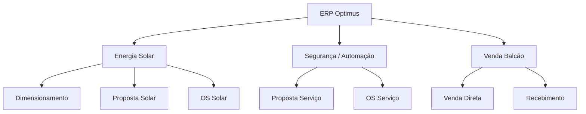
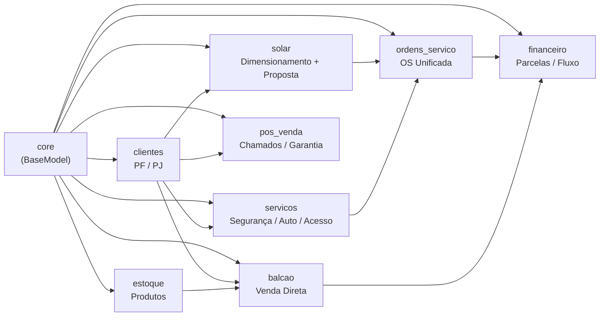
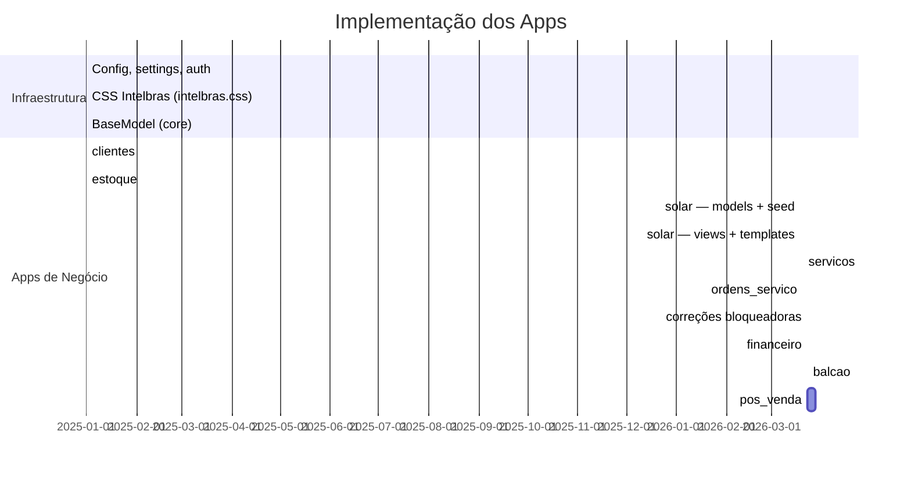
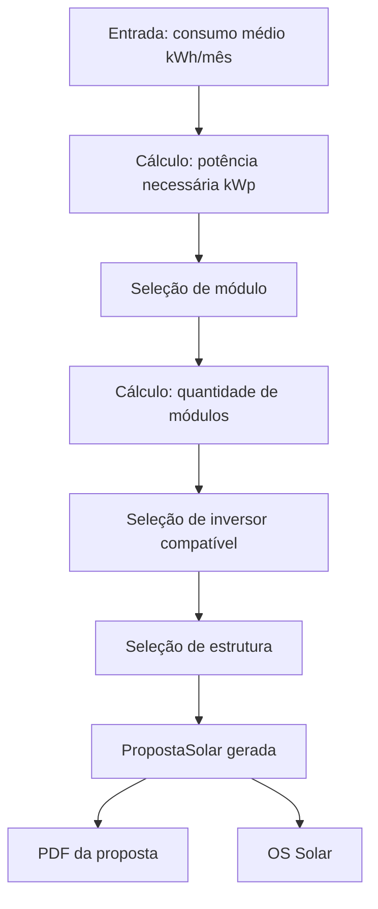

# Diário de Desenvolvimento — ERP Optimus

> Registro cronológico das decisões e etapas de implementação.
> Atualizar a cada sessão de desenvolvimento.

---

## 📍 Estado Atual — TL;DR (atualizado: 2026-08-16)

> **Para agentes de IA:** Leia este bloco primeiro. Ele resume o estado real do projeto sem necessidade de ler todo o diário.

| App              | Status     | Última ação relevante                                                                   |
| ---------------- | ---------- | --------------------------------------------------------------------------------------- |
| `core`           | ✅ Completo | `BaseModel` com `criado_em`/`atualizado_em`                                             |
| `clientes`       | ✅ Completo | CRUD PF/PJ, validações, busca CEP/CNPJ                                                  |
| `estoque`        | ✅ Completo | Importação `.xlsb`, catálogo Intelbras                                                  |
| `solar`          | ✅ Completo | Dimensionamento HTMX, proposta, catálogo equipamentos com preços, quantidades editáveis |
| `servicos`       | ✅ Completo | Proposta por tipo de serviço                                                            |
| `ordens_servico` | ✅ Completo | OS com checklist, fotos, técnicos, faturamento                                          |
| `financeiro`     | ✅ Completo | Lançamentos, parcelas, baixas, dashboard                                                |
| `balcao`         | ✅ Completo | PDV carrinho HTMX, baixa estoque, lançamento automático                                 |
| `pos_venda`      | ✅ Completo | Chamados, interações, histórico do cliente                                              |

**Dívida técnica prioritária (ver ROADMAP.md):**

1. 🔴 Type Hints ausentes em views e services
2. 🟡 Dashboards síncronos (candidatos a async)
3. 🔴 Mojibake em 24 produtos do `estoque` (importação da planilha Intelbras)

**Atualizações Recentes:**

- `[2026-08-16]` **Análise de retorno refeita conforme a Lei 14.300/2022** — o usuário olhou o PDF gerado e reprovou: "achei o cálculo de retorno pobre", anexando a própria fatura da Energisa TO. Estava certo — o cálculo era `geração × tarifa`, que superestima a economia por ignorar tudo que a GD **não** compensa. Novo motor em `solar/services.py` considera: Fio B gradual sobre a energia compensada (15/30/45/60/75/90% de 2023 a 2028, 100% a partir de 2029 por hipótese conservadora — a ANEEL só redefine no art. 28), custo de disponibilidade (30/50/100 kWh mono/bi/tri, REN 414/2010), COSIP nunca compensada, degradação dos módulos (0,5%/ano) e reajuste tarifário (7%/ano). **Âncora de verificação:** a fórmula reproduz a fatura real — `1,385750 − (0,313783 × 0,60) = 1,197480` bate exatamente com a linha "Energia Atv Injetada GDI", e o total fecha em R$ 199,39 (tolerância de 2 centavos, porque a distribuidora arredonda linha a linha). No meio do caminho o usuário apontou outra lacuna real: **autoconsumo simultâneo** — a energia consumida no instante em que é gerada não passa pela rede, logo escapa do Fio B e vale tarifa cheia; virou campo por proposta (padrão 25%), junto com `tipo_ligacao`. Fio B e COSIP são regionais e ficaram em `Configuracao`. PDF ganhou gráfico de barras da economia anual (SVG inline gerado no servidor, série única no verde da marca, sem lib) e uma seção "Como esta conta foi feita" que deixa o Fio B explícito. 30 testes novos, 137 no total. Ver skill solar-domain §8.
- `[2026-08-16h]` **Descoberta do modelo de negócio real — financeiro estava contando dinheiro que a empresa nunca recebe.** Puxando um fio sobre integração com Intelbras/Belenus (pesquisado: nenhuma das duas tem API pública — ambas são portal de parceiro manual, mesmo padrão do `.xlsb` que o `estoque` já usa), o usuário explicou o modelo de negócio de verdade: o cliente compra o gerador **direto do fornecedor**, sem margem da Optimus — é assim que a venda fica isenta do ICMS que incidiria se a empresa mantivesse estoque próprio (prática comum no mercado solar). O caixa real vem só de instalação e manutenção. Isso expôs que a correção de faturamento duplicado de mais cedo hoje partiu de premissa errada: `criar_lancamento_de_proposta_solar` lançava o valor do equipamento como receita da Optimus, e o dashboard (`financeiro/views.py`) somava isso nos KPIs de faturamento — inflando a receita real pelo preço do gerador inteiro. `LancamentoFinanceiro` ganhou `tipo` (`receita`/`repasse`); o lançamento de equipamento agora nasce como repasse, visível na lista/detalhe com badge mas **fora** dos KPIs do dashboard. O PDF da proposta continua mostrando o valor combinado (decisão deliberada — é o que o cliente realmente vai gastar). 5 testes novos, 219 no total. ROADMAP reorganizado no mesmo dia por completo (ver entrada abaixo) — essa descoberta valida a decisão de focar em "o que afeta o cliente" antes de produção.
- `[2026-08-16g]` **ROADMAP reorganizado + duas correções que afetam o cliente.** O usuário disse estar confuso, com razão: o arquivo tinha 30 linhas misturando feito e pendente, e as "Fases 0–4" abaixo **contradiziam** a tabela (Fase 4 pedia RBAC que já existe desde 2026-08-09; Fase 3 pedia o PDF que já está pronto). Reescrito por prioridade real — *"o que impede usar com um cliente de verdade?"* em vez de categoria técnica — com uma seção "Próximo passo" no topo. Contexto que mudou a ordem: produção não tem pressa (a empresa opera há anos sem ferramenta), então tudo que só importa no deploy foi rebaixado. Números stale corrigidos (views 500/346/305/305, 14 migrations, 1.249 inline styles). **Achado no meio do caminho:** "composição de preço incompleta" não era preço faltando — o catálogo tem **5 itens no total** (1 módulo, 1 inversor, 1 estrutura, 2 materiais), todos com preço vigente. Não dá pra incluir estrutura e cabos numa proposta se eles não existem no cadastro. Corrigido: `potencia_kw` do SAJ 6K-R5 (6000 → 6), com validador de faixa nos dois models para o erro de unidade não voltar; e `PropostaSolar.pendencias` + card na tela de detalhe, que lista o que falta antes da proposta virar PDF. 10 testes novos, 214 no total.
- `[2026-08-16f]` **Auditoria externa (Gemini/Antigravity + GPT-5.3) — 12 achados verificados, 5 corrigidos.** Todos os achados procediam; nenhum era alucinação. **O crítico:** faturamento duplicado — aprovar a proposta lançava `valor_total` e faturar a OS lançava `valor_total` de novo. Provado em teste: proposta de R$ 10.000 gerava R$ 20.000 em lançamentos. **Dano real: zero** — o banco tinha 1 lançamento e nenhuma OS ligada a proposta, então o bug era latente. Divisão definida pelo usuário: aprovação lança equipamentos, faturamento da OS lança mão de obra. **Ponto cego dos dois relatórios:** dois achados que eles trataram como separados têm a mesma causa-raiz — `formset.save(commit=False)` devolve só as linhas novas ou alteradas, não o formset inteiro. Testei e é pior que o descrito: editar 1 de 2 linhas gravava 8 módulos com 14 no banco, derrubando a potência de 5,6 para 3,2 kWp na ficha do cliente. Não precisa de edge case, é uma edição trivial. Também entraram travas de estado (`SomenteRascunhoMixin`, no `dispatch` para não deixar POST na mão passar), `transaction.atomic` nas transições, `financeiro/tests.py` (app antes sem cobertura), teste que falha se algum app for incluído sem namespace (fecha o fail-open do RBAC), remoção de `views_backup_original.py` e correção do README. **Onde discordei:** GPT rankeou inline styles como Alto — é dívida de manutenção sem risco financeiro; e propôs testes para os 4 apps sem cobertura como primeira trilha, o que congelaria o faturamento duplicado como comportamento correto. 21 testes novos, 204 no total.
- `[2026-08-16e]` **HSP automático por município + curva de geração mês a mês.** `solar/geo.py` consome IBGE (lista de municípios e malha para extrair centroide — 2 requisições por UF) e NASA POWER (climatologia de irradiação por coordenada, 1 por município). Comandos `importar_municipios --uf TO` e `sincronizar_hsp --uf TO`; os 139 municípios do Tocantins já estão sincronizados. **A premissa que já estava no código se confirmou:** Gurupi mede 5,58 h/dia contra os 5,50 do padrão histórico (CRESESB). A faixa no estado vai de 5,14 (Ananás) a 5,72 (Arraias), e a sazonalidade em Gurupi de 5,25 (mai) a 6,17 (set). A proposta ganhou FK de `municipio` — **local da instalação, não do cliente**: vem pré-preenchido do endereço cadastrado (casamento por nome+UF sem acento) mas é trocável, porque o gerador pode ser para outro endereço. A geração agora usa HSP do mês e **dias reais** em vez de 30 fixos (30 fixo subestimava ~1,4% no ano), e o PDF ganhou gráfico de barras mensal com linha de média. Armadilha resolvida: o IBGE devolve gzip mesmo pedindo `identity` e sem marcar `Content-Encoding` — detecção pelo número mágico. 19 testes novos, 187 no total.
- `[2026-08-16d]` **Integração com os dados abertos da ANEEL + correção de erro grave de cálculo.** O usuário perguntou se a API da ANEEL poderia enriquecer a aplicação — poderia, e no caminho revelou que **a análise de retorno estava errada em ~29%**. A fatura que eu tinha usado como âncora era de um consumidor **GD1**, que por direito adquirido não paga Fio B; eu atribuí ao Fio B uma diferença que na verdade é **tributo** (o crédito da energia injetada leva ICMS efetivo de ~7,3% contra 20% do consumo). Com a segunda fatura (GDII) ficou explícito: o Fio B real aparece como linha própria e isenta, "Ajuste GDII - TRF Reduzida (Lei 14.300/22)". Agora `solar/aneel.py` consome o dataset `componentes-tarifarias` (CKAN, sem chave), `sincronizar_tarifas_aneel` espelha TUSD/TE/TUSD_FioB por vigência em `TarifaDistribuidora`, e o gross-up de tributos foi verificado nas duas faturas com erro de 0,0005%. Achado secundário no mesmo teste: o custo de disponibilidade é **piso da conta**, não teto da compensação — a fatura compensa o consumo inteiro e só depois garante o mínimo. Efeito prático numa proposta real: economia de 25 anos caiu 23,8% e o payback subiu de 1 ano e 1 mês para 1 ano e 3 meses. 31 testes novos, 168 no total, ancorados nas duas faturas. Ver skill solar-domain §8.
- `[2026-08-16c]` Três correções a partir do PDF real revisado pelo usuário: (1) **comentário vazando de novo** — usei `{# #}` de duas linhas no bloco do gráfico, exatamente a armadilha que eu tinha acabado de documentar no `AGENTS.md`; o teste de regressão existia mas não pegou porque não preenchia `tarifa_kwh`, então as seções novas nem renderizavam — teste corrigido para cobrir os dois estados. (2) Rótulos das pontas do gráfico saíam cortados nas bordas: agora a primeira ancora em `start` e a última em `end` (e o `text-anchor` saiu do CSS, que vencia o atributo de apresentação). Os **valores estavam corretos**, era recorte visual. (3) Payback deixou de ser decimal ("1,1 anos") e virou "1 ano e 1 mês" — pedido do usuário; precisão do cálculo subiu de 0,1 para 0,001 ano, senão a granularidade (~1,2 mês) não daria pra formatar meses. 151 testes.
- `[2026-08-16b]` Moeda no padrão `R$ 1.234.567,89` em todo o app via `USE_THOUSAND_SEPARATOR=True` — uma linha no settings resolve os 63 `|floatformat:2` espalhados pelos templates. Verificado antes que não quebra `<input type="number">` (widgets não são localizados por padrão). **Mas mordeu de outro jeito:** a localização vale pra *todo* número do template, então o `viewBox` do gráfico virou `680,0` e o ano virou `2.026`. Corrigido emitindo os números técnicos como string desde o Python; armadilha documentada no `AGENTS.md` e travada por teste de regressão.
- `[2026-08-15]` Financiamento/parcelamento no cartão no card "Resumo para fechamento" — fecha a lacuna deixada em aberto em `[2026-08-13f]`. Model novo `TaxaCartao` (forma/bandeira/parcelas/percentual) gerenciável via Django Admin (`list_editable`, mesmo padrão de `PrecoEquipamentoSolarAdmin`), seed com a tabela real Intelbras (87 linhas, obtida da planilha do usuário via export CSV do Google Sheets) através de `python manage.py seed_taxas_cartao`. Card ganhou dois seletores HTMX (bandeira + toggle "Com entrada"/"100% no cartão", entrada = `valor_instalacao`, nunca exposta como tal no texto) que recalculam a tabela completa 2x–21x ao vivo. **Fórmula corrigida em cima da hora:** a hipótese inicial (`valor * (1 + taxa)`) estava errada — só descoberto ao buscar a planilha real e verificar contra 4 pontos de referência; fórmula certa é `valor / (1 - taxa/100)`. Escopo deliberadamente reduzido pelo usuário: só a tabela oficial Intelbras entra (a comparação entre 3 adquirentes tinha bugs visíveis na planilha e foi descartada), financiamento bancário fica de fora (lógica própria, não é taxa de adquirente). 14 testes novos (fórmula, seed, integração HTTP do card), 108 no total. Ver skill `solar-domain.md` §11.2.
- `[2026-08-13f]` Card "Resumo para fechamento" em `proposta_detail.html`: textarea pré-preenchida (Pré Projeto/Geração Pretendida/equipamento/valor "tudo por nossa conta"/à vista) + botão Copiar (`navigator.clipboard`, com fallback `execCommand` pra contexto HTTP sem clipboard API). Motivado pelo usuário mostrar sua copy real de WhatsApp — "talvez meu melhor instrumento de fechamento", hoje montada manualmente. Novas properties em `PropostaSolar`: `geracao_mensal_kwh` (movida de dentro da view de print pra cá, DRY), `inversor_principal` e `quantidade_inversores` (o model só rastreava um FK de módulo de referência, nada de inversor). **Em aberto:** usuário trouxe as tabelas reais de parcelamento (3 adquirentes diferentes — Plataforma/SOOLLAR/Infinity — cada um com taxa própria por parcela, mais a tabela oficial Intelbras por bandeira de cartão) — é bem mais complexo que uma taxa fixa única, ainda não modelado. 6 testes novos, 94 no total.
- `[2026-08-13e]` Correções no PDF da proposta a partir de feedback visual do usuário testando de verdade: (1) **bug real** — comentário `{# ... #}` de 3 linhas em `base_print.html` nunca foi reconhecido como comentário pelo Django (esse marcador só funciona numa linha só) e vazava texto literal no topo do documento que iria pro cliente; trocado por `...`, que suporta múltiplas linhas de verdade — confirmado com reprodução isolada antes de corrigir. (2) Tabela de equipamentos parou de mostrar preço por item (só o total, na seção Investimento — decisão de negócio do usuário). (3) Especificação de cada item simplificada: nome vem só de fabricante+modelo (não mais o `__str__` com a potência repetida entre parênteses), linha técnica reduzida a 1-2 fatos essenciais + garantia (removido tipo/fase do inversor, eficiência do módulo, material da estrutura), nomes em CAIXA ALTA do catálogo ganham `text-transform: capitalize` só no documento. 2 testes novos (ausência de preço por item, ausência de vazamento de `{#`/`#}` no HTML — trava a regressão do bug do comentário). 88 testes passando.
- `[2026-08-13d]` PDF de proposta solar (etapa 5, fecha o redesenho do fluxo de propostas desta sessão): `/solar/<pk>/imprimir/`, layout A4 via `templates/base_print.html` (novo skeleton sem topbar/sidebar/htmx, reutilizável por outras telas de impressão futuras) + `static/css/print.css`. `window.print()` do navegador é o "gerar PDF" — zero dependência nova. Decisão deliberada: **não mostra payback nem economia em R$** — calcular isso exigiria uma tarifa (R$/kWh) que não existe em nenhum model hoje; inventar um número seria prometer economia sem dado real. 7 testes novos. 86 testes passando no total.
- `[2026-08-13c]` Sugestão automática de inversor compatível na proposta solar: relação CC:CA (potência do sistema ÷ potência do inversor) contra uma faixa configurável (`inversor_sobrecarga_minima_pct`/`_maxima_pct` em Configuracao, padrão 80%–135%). O preview do dimensionamento agora lista os inversores ativos com badge verde/alerta e botão "Usar este inversor" (reaproveita o mesmo endpoint `adicionar-item`, generalizado pra aceitar módulo/inversor/estrutura/material). **Achado no meio do caminho:** o único inversor real cadastrado no banco está com `potencia_kw=6000.00` (deveria ser 6.00, pelo nome do modelo "6K-R5") — sinalizado como tarefa separada, não corrigido aqui. 79 testes passando no total (34 solar + 8 configuracoes). Lembrete: rodar `python manage.py migrate` após puxar — a migration do `configuracoes` (do commit anterior) só foi aplicada no banco de dev agora, ao testar esta feature.
- `[2026-08-13b]` App `configuracoes` (painel central de parâmetros de negócio, singleton, só Administrador) — primeiro parâmetro: `desconto_maximo_balcao_pct` (ainda não aplicado no balcão, ficou pausado). RBAC ganhou o filtro `in_group` pra esconder do menu links que o middleware já bloqueava (Financeiro e o card de KPI do dashboard apareciam pra quem não tinha acesso). **Bug real corrigido no módulo Solar:** `PropostaSolarForm` não incluía o campo `modulo` — o dropdown "Módulo de referência" renderizava vazio (só o rótulo, sem `<select>`), então a calculadora de dimensionamento nunca calculava quantidade de módulos, só o kWp necessário. Corrigido + conectado: botão "Usar este dimensionamento" agora insere o item pré-preenchido na tabela, sem precisar redigitar. Avaliação completa do módulo Solar registrada no ROADMAP (PDF de proposta e sugestão de inversor compatível ainda faltam). 69 testes passando no total.
- `[2026-08-13]` Corrigido bug de CSS ausente em dev (`STATICFILES_STORAGE` exigia manifesto de `collectstatic`, que só roda em produção — trocado por `STORAGES` condicional). Ao validar, encontrado e corrigido problema de segurança real: `DEBUG=True` do `.env` local vazava para produção quando `DJANGO_ENV=production` era setado sem outras variáveis. Duas travas agora: `.env` não é lido quando `DJANGO_ENV=production`, e `DEBUG` é `False` fixo em produção independente da variável. 3 testes novos (subprocesso, recarregam settings do zero). 53 testes passando no total.
- `[2026-08-09]` **Retomada após pausa — preparação para produção.** RBAC implementado (3 grupos, matriz central em `core/permissoes.py` + middleware), settings endurecido (HTTPS/HSTS/cookies sob `DJANGO_ENV=production`), suporte a PostgreSQL via `DATABASE_URL` e comando `backup_db` (testado com restauração real). 50 testes passando. **Falta para publicar:** contratar hospedagem com Python — o plano Hostinger atual não roda Django.
- `[2026-04-14]` Refatoração da Sidebar: Agrupamento de links técnicos (Módulos, Inversores, etc.) dentro de um dropdown "Componentes" para reduzir poluição visual no app Solar. Implementado via CSS puro (acordeão de 2º nível).

**Stack:** Python 3.13 · Django 6.0.3 · CSS puro (intelbras.css) · HTMX · SQLite (dev)

---


---

## Visão geral do projeto



---

## Mapa de apps e dependências



---

## Status de implementação



---

## Progresso por sessão

---

### Sessão 1 — Configuração inicial

**Data:** antes de 2026-03-19
**Objetivo:** Estrutura base do projeto

**O que foi feito:**

- Criação do projeto Django com settings em `config/`
- Configuração de WhiteNoise para arquivos estáticos
- Autenticação Django nativa (login/logout)
- `BaseModel` abstrato em `core/` com `criado_em` e `atualizado_em`
- Dashboard inicial em `core/`
- CSS completo em `static/css/intelbras.css` (tema verde Intelbras)
- `base.html` com topbar + sidebar + área principal

**Decisões técnicas:**

- SQLite em dev → PostgreSQL em produção
- Apps ficam na raiz do projeto (não em `apps/`)
- Settings module: `config.settings`
- Nenhum framework CSS — CSS puro com variáveis

---

### Sessão 2 — App `clientes`

**Data:** antes de 2026-03-19
**Objetivo:** Cadastro completo de clientes PF e PJ

**O que foi feito:**

- Model `Cliente` com detecção automática PF/PJ pelo tamanho do CPF/CNPJ no `save()`
- Validação de CPF e CNPJ com algoritmo de dígito verificador
- Máscaras de entrada: CPF, CNPJ, telefone, CEP
- Busca automática de CEP via ViaCEP (AJAX)
- Preenchimento automático de CNPJ via BrasilAPI (AJAX)
- CRUD completo: list, create, detail, update, delete
- Paginação: 20 por página
- Filtro e busca na listagem
- Soft delete via campo `ativo`

**Campos do model:**

```code
tipo (PF/PJ, editable=False — detectado automaticamente)
cpf_cnpj, nome, nome_fantasia, rg_ie, data_nascimento
telefone, celular, email
cep, logradouro, numero, complemento, bairro, cidade, estado
observacoes, ativo
```

---

### Sessão 3 — App `estoque`

**Data:** antes de 2026-03-19
**Objetivo:** Catálogo de produtos Intelbras

**O que foi feito:**

- Model `Produto` com campos fiscais e comerciais da tabela Intelbras
- Importação de tabela de preços `.xlsb` e `.xlsx` (openpyxl + pyxlsb)
- Mapeamento flexível de colunas da planilha
- Propriedade `margem` calculada: `(pscf - psd) / pscf * 100`
- CRUD completo com filtros por BU e segmento
- Paginação: 30 por página

**Campos do model:**

```code
codigo (unique), descricao, bu, segmento, familia
ncm, ean, ipi, icms
psd (custo), pscf (venda), preco_referencia, qtd_multipla
observacoes, ativo
```

**Dependências instaladas:**

- `openpyxl >= 3.1.0` — leitura .xlsx
- `pyxlsb >= 1.0.10` — leitura .xlsb (formato binário Intelbras)

---

### Sessão 4 — App `solar` — Models e dados de referência

**Data:** 2026-03-19
**Objetivo:** Estrutura de equipamentos solares com dados reais do mercado

**O que foi feito:**

- App `solar` criado e registrado em `INSTALLED_APPS`
- 3 models criados:
  - `ModuloFotovoltaico`
  - `Inversor`
  - `EstruturaFixacao`
- Migration `0001_initial` aplicada
- Management command `seed_solar` com dados reais do mercado brasileiro
- Admin registrado para os 3 models

**Dados carregados via `seed_solar`:**

| Categoria  | Registros | Marcas                                      |
| ---------- | --------- | ------------------------------------------- |
| Módulos    | 8         | Canadian Solar, BYD, JA Solar, Risen, Trina |
| Inversores | 13        | Growatt, WEG, Fronius, Hoymiles, Deye       |
| Estruturas | 8         | Romagnole, Yamada, Exmetal                  |

**Campos `ModuloFotovoltaico`:**

```code
fabricante, modelo, potencia_wp, eficiencia
voc, isc, largura, altura, peso
garantia_produto, garantia_desempenho, ativo
```

**Campos `Inversor`:**

```code
fabricante, modelo, potencia_kw
tipo (string | micro | hibrido)
fase (monofasico | trifasico)
tensao_max_entrada, quantidade_mppt, garantia, ativo
```

**Campos `EstruturaFixacao`:**

```code
fabricante, modelo
tipo (ceramico | metalico | fibrocimento | laje | solo)
material (aluminio | aco_galvanizado)
descricao, ativo
```

**Entregues nesta sessão:**

- [x] Model `PropostaSolar` com numeração automática `SOL-YYYYMM-NNNN`
- [x] Lógica de dimensionamento (kWh → kWp → módulos → inversor)
- [x] CRUD completo de propostas (list, create, detail, update, delete)
- [x] Endpoint HTMX `/solar/dimensionar/` para preview em tempo real
- [x] Total financeiro calculado via JS no formulário
- [x] Sidebar atualizada com link Solar funcional

**Próximos passos para `solar`:**

- [ ] PDF da proposta

---

## Próximo app: `solar` — Dimensionamento



**Fórmula base de dimensionamento:**

```code
kWp = (consumo_kwh / 30) / hsp_local
qtd_modulos = ceil(kWp * 1000 / potencia_wp_modulo)
```

> HSP (Horas de Sol Pleno) de Palmas/TO ≈ 5.5 h/dia

---

### Sessão 5 — Correções + App `financeiro` + App `balcao`

**Data:** 2026-03-23
**Objetivo:** Fechar débitos técnicos críticos e implementar os módulos de receita

---

#### Bloco 0 — Correções de regras de negócio

**0a — Validação XOR no `OrdemServicoForm`**

- Adicionado `clean()` em `ordens_servico/forms.py`
- Impede OS com `proposta_solar` E `proposta_servico` simultaneamente
- Valida que o cliente da OS bate com o cliente da proposta vinculada

**0b — Transição `faturada` na OS**

- Criada view `faturar_os` em `ordens_servico/views.py`
- Rota `<int:pk>/faturar/` adicionada a `ordens_servico/urls.py`
- Botão "Marcar como Faturada" aparece em `os_detail.html` quando status == `concluida`
- A view chama `financeiro.services.criar_lancamento_de_ordem_servico(os_obj)`

**0c — `quantidade_modulos` readonly no solar**

- Campo marcado como `readonly` + `cursor: not-allowed` em `solar/forms.py`
- Template `_dimensionamento_preview.html` injeta o valor calculado via JS inline
- Usuário não digita mais um valor que seria ignorado

**0d — Hardening do `settings.py`**

- `SECRET_KEY` agora levanta `RuntimeError` se ausente em produção (`DJANGO_ENV=production`)
- Em desenvolvimento usa chave insegura explícita (não mais a hardcoded anterior)
- `ALLOWED_HOSTS` continua com `*` apenas como fallback de dev

---

#### Bloco 1 — App `financeiro`

**Models:**

- `LancamentoFinanceiro` — caixa central com 4 FKs nullable de origem (balcao, solar, servicos, os)
- `ParcelaLancamento` — 1 parcela para à vista, N para parcelado
- `BaixaFinanceira` — registro imutável de cada pagamento, com `registrado_por`
- Status calculado (`vencido`) em runtime via `@property esta_vencido` — não persiste no banco

**Services (`financeiro/services.py`):**

- `criar_lancamento_de_proposta_solar(proposta)`
- `criar_lancamento_de_proposta_servico(proposta)`
- `criar_lancamento_de_ordem_servico(os_obj)`
- `criar_lancamento_de_venda_balcao(venda)` — baixa automática para pagamentos à vista (dinheiro/pix/débito)

**Integração:**

- `solar/views.py:aprovar_proposta` → chama `criar_lancamento_de_proposta_solar`
- `servicos/views.py:aprovar_proposta` → chama `criar_lancamento_de_proposta_servico`
- `ordens_servico/views.py:faturar_os` → chama `criar_lancamento_de_ordem_servico`

**Views e URLs:**

- `LancamentoListView` — filtros: busca, status, origem, forma, período; 4 KPIs no topo
- `LancamentoDetailView` — resumo financeiro, tabela de parcelas, histórico de baixas
- `LancamentoCreateView` / `LancamentoUpdateView` — lançamento manual
- `cancelar_lancamento` — POST, cancela parcelas pendentes junto
- `registrar_baixa` — POST, atualiza `valor_recebido` + status do lançamento e parcela
- `dashboard` — KPIs, gráfico de barras por forma de pagamento, vencimentos próximos, em atraso

**Templates:**

- `lancamento_list.html`, `lancamento_detail.html`, `lancamento_form.html`, `dashboard.html`
- Sidebar: Financeiro vira `<details>` com submenus Lançamentos e Dashboard

---

#### Bloco 2 — App `balcao`

**Models:**

- `Venda` — ciclo rascunho → finalizada → cancelada; `cliente` nullable (permite avulso)
- `ItemVenda` — snapshot de preço no momento da venda; `quantidade` como Decimal
- `recalcular_totais()` — método que soma itens e aplica desconto; chamado a cada mudança de carrinho

**Fluxo UX:**

- "Nova Venda" → cria rascunho e redireciona para `editar_venda`
- Layout 2 colunas: carrinho (flex 2) + resumo sticky (flex 1)
- Busca de produto por código/nome: HTMX GET → partial `_produto_resultados.html`
- Busca de cliente por nome/CPF: HTMX GET → partial `_cliente_resultados.html`
- Adicionar item: HTMX POST → retorna `_carrinho.html` (tabela atualizada)
- Remover item: HTMX POST → retorna `_carrinho.html`
- Total calculado em tempo real via JS inline (sem request de rede)
- Parcelas aparecem apenas se forma == `cartao_credito`

**Finalização (`finalizar_venda`):**

- Valida: tem itens? tem forma de pagamento?
- `transaction.atomic`: recalcula totais → finaliza → baixa estoque (se `quantidade_estoque` existir) → cria lançamento financeiro

**Sidebar:** link do Balcão conectado a ``

---

## Stack e versões

| Tecnologia    | Versão   | Observação             |
| ------------- | -------- | ---------------------- |
| Python        | 3.13     | —                      |
| Django        | 6.0.3    | Verificar estabilidade |
| openpyxl      | ≥ 3.1.0  | Import .xlsx           |
| pyxlsb        | ≥ 1.0.10 | Import .xlsb Intelbras |
| whitenoise    | 6.12.0   | Static files           |
| python-dotenv | 1.2.2    | .env                   |
| ruff          | 0.15.6   | Linter                 |

---

## Convenções do projeto (resumo rápido)

- Português em todos os campos, labels e verbose_name
- CBVs para CRUD (CreateView, UpdateView, DeleteView, ListView, DetailView)
- Templates em `<app>/templates/<app>/`
- `` — nunca URL hardcoded
- CSS: sempre `var(--verde)`, nunca cor literal no HTML
- Ícones: `bi bi-nome` (Bootstrap Icons CDN)
- HTMX: só para atualizações parciais simples
- Sem Bootstrap, sem Tailwind, sem JS complexo

---

### Sessão 6 — Análise do Projeto, Roadmap Sistêmico e Gargalos

**Data:** 14/04/2026
**Objetivo:** Auditar o estado atual da arquitetura e traçar metas futuras (ROADMAP).

**O que foi feito:**

- Correção crítica no erro 500 do módulo `solar`: Importação do form `PrecoEquipamentoSolarForm` no escopo da base do cadastro e visibilidade de Inversores.
- Refatoração do `PropostaSolar`: Liberação dos campos `quantidade_inversores` e `quantidade_estruturas` para a edição na proposta comercial. Deixado de ser restrito para calculo imutável (o usuário edita o número de painéis/inversores como deseja após o cálculo HTMX inicial).
- Análise Sintética da aplicação perante o *STRICT MODE*:
  - Constatou-se uma sólida aderência ao paradigma Sever-Driven UI sem bloated libraries (Nenhum DRF, AlpineJs complexo ou Celery em uso). O CSS via tokens `:root` está íntegro na lógica.
- Criação de artefato persistente de acompanhamento futuro `ROADMAP.md` guardado em `.claude/ROADMAP.md`.

**Decisões e Conclusões Arquiteturais Pendentes (Roadmap priorizado):**

- **Falta de Strict Typing:** Como passo 1, é exigido reformar as funções para comportar Type Hints rigorosos no Python.
- **Transição Síncrona -> Assíncrona:** Identificado que muitas chamadas do Balcão, Estoque e Dashboard Financeiro causam sobrecargas simultâneas em *transaction atomic* no banco de dados bloqueando a resposta do Backend. Estas deverão migrar para a estrutura nativa de Tasks e Async Views inauguradas nas recentes versões do Django.
- As implementações das funcionalidades cruciais finais de PDF's de contrato e Pós-Venda ficam seguradas para depois do pagamento dessa Divida Técnica (*Tech Debt*).
