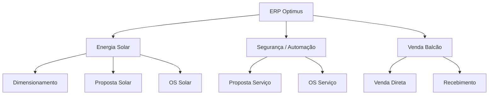
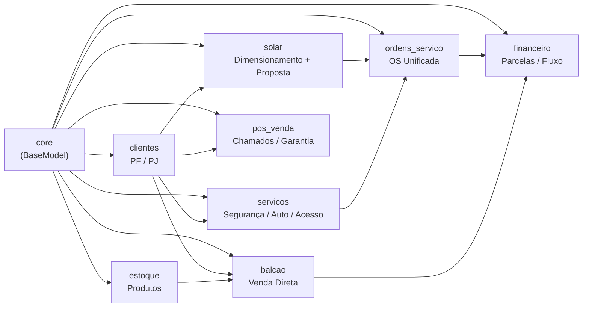
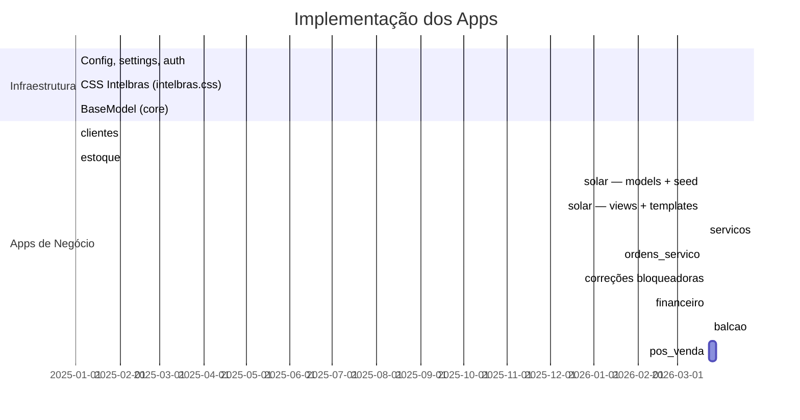
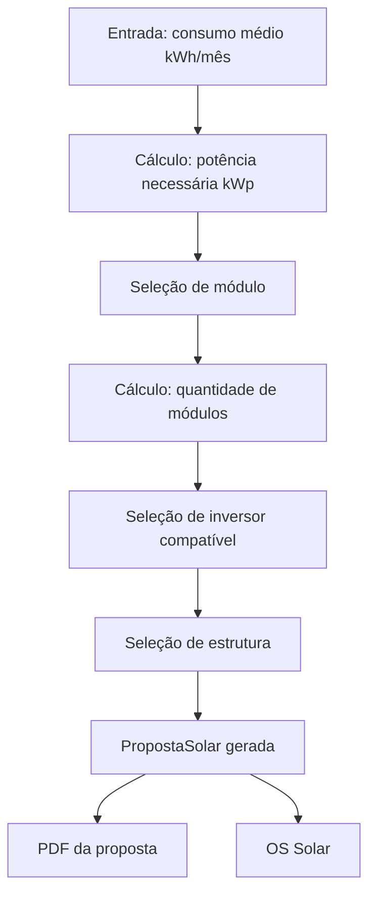

# Diário de Desenvolvimento — ERP Optimus

> Registro cronológico das decisões e etapas de implementação.
> Atualizar a cada sessão de desenvolvimento.

---

## Visão geral do projeto



---

## Mapa de apps e dependências



---

## Status de implementação



---

## Progresso por sessão

---

### Sessão 1 — Configuração inicial

**Data:** antes de 2026-03-19
**Objetivo:** Estrutura base do projeto

**O que foi feito:**
- Criação do projeto Django com settings em `config/`
- Configuração de WhiteNoise para arquivos estáticos
- Autenticação Django nativa (login/logout)
- `BaseModel` abstrato em `core/` com `criado_em` e `atualizado_em`
- Dashboard inicial em `core/`
- CSS completo em `static/css/intelbras.css` (tema verde Intelbras)
- `base.html` com topbar + sidebar + área principal

**Decisões técnicas:**
- SQLite em dev → PostgreSQL em produção
- Apps ficam na raiz do projeto (não em `apps/`)
- Settings module: `config.settings`
- Nenhum framework CSS — CSS puro com variáveis

---

### Sessão 2 — App `clientes`

**Data:** antes de 2026-03-19
**Objetivo:** Cadastro completo de clientes PF e PJ

**O que foi feito:**
- Model `Cliente` com detecção automática PF/PJ pelo tamanho do CPF/CNPJ no `save()`
- Validação de CPF e CNPJ com algoritmo de dígito verificador
- Máscaras de entrada: CPF, CNPJ, telefone, CEP
- Busca automática de CEP via ViaCEP (AJAX)
- Preenchimento automático de CNPJ via BrasilAPI (AJAX)
- CRUD completo: list, create, detail, update, delete
- Paginação: 20 por página
- Filtro e busca na listagem
- Soft delete via campo `ativo`

**Campos do model:**
```
tipo (PF/PJ, editable=False — detectado automaticamente)
cpf_cnpj, nome, nome_fantasia, rg_ie, data_nascimento
telefone, celular, email
cep, logradouro, numero, complemento, bairro, cidade, estado
observacoes, ativo
```

---

### Sessão 3 — App `estoque`

**Data:** antes de 2026-03-19
**Objetivo:** Catálogo de produtos Intelbras

**O que foi feito:**
- Model `Produto` com campos fiscais e comerciais da tabela Intelbras
- Importação de tabela de preços `.xlsb` e `.xlsx` (openpyxl + pyxlsb)
- Mapeamento flexível de colunas da planilha
- Propriedade `margem` calculada: `(pscf - psd) / pscf * 100`
- CRUD completo com filtros por BU e segmento
- Paginação: 30 por página

**Campos do model:**
```
codigo (unique), descricao, bu, segmento, familia
ncm, ean, ipi, icms
psd (custo), pscf (venda), preco_referencia, qtd_multipla
observacoes, ativo
```

**Dependências instaladas:**
- `openpyxl >= 3.1.0` — leitura .xlsx
- `pyxlsb >= 1.0.10` — leitura .xlsb (formato binário Intelbras)

---

### Sessão 4 — App `solar` — Models e dados de referência

**Data:** 2026-03-19
**Objetivo:** Estrutura de equipamentos solares com dados reais do mercado

**O que foi feito:**
- App `solar` criado e registrado em `INSTALLED_APPS`
- 3 models criados:
  - `ModuloFotovoltaico`
  - `Inversor`
  - `EstruturaFixacao`
- Migration `0001_initial` aplicada
- Management command `seed_solar` com dados reais do mercado brasileiro
- Admin registrado para os 3 models

**Dados carregados via `seed_solar`:**

| Categoria | Registros | Marcas |
|---|---|---|
| Módulos | 8 | Canadian Solar, BYD, JA Solar, Risen, Trina |
| Inversores | 13 | Growatt, WEG, Fronius, Hoymiles, Deye |
| Estruturas | 8 | Romagnole, Yamada, Exmetal |

**Campos `ModuloFotovoltaico`:**
```
fabricante, modelo, potencia_wp, eficiencia
voc, isc, largura, altura, peso
garantia_produto, garantia_desempenho, ativo
```

**Campos `Inversor`:**
```
fabricante, modelo, potencia_kw
tipo (string | micro | hibrido)
fase (monofasico | trifasico)
tensao_max_entrada, quantidade_mppt, garantia, ativo
```

**Campos `EstruturaFixacao`:**
```
fabricante, modelo
tipo (ceramico | metalico | fibrocimento | laje | solo)
material (aluminio | aco_galvanizado)
descricao, ativo
```

**Entregues nesta sessão:**
- [x] Model `PropostaSolar` com numeração automática `SOL-YYYYMM-NNNN`
- [x] Lógica de dimensionamento (kWh → kWp → módulos → inversor)
- [x] CRUD completo de propostas (list, create, detail, update, delete)
- [x] Endpoint HTMX `/solar/dimensionar/` para preview em tempo real
- [x] Total financeiro calculado via JS no formulário
- [x] Sidebar atualizada com link Solar funcional

**Próximos passos para `solar`:**
- [ ] PDF da proposta

---

## Próximo app: `solar` — Dimensionamento



**Fórmula base de dimensionamento:**
```
kWp = (consumo_kwh / 30) / hsp_local
qtd_modulos = ceil(kWp * 1000 / potencia_wp_modulo)
```

> HSP (Horas de Sol Pleno) de Palmas/TO ≈ 5.5 h/dia

---

### Sessão 5 — Correções + App `financeiro` + App `balcao`

**Data:** 2026-03-23
**Objetivo:** Fechar débitos técnicos críticos e implementar os módulos de receita

---

#### Bloco 0 — Correções de regras de negócio

**0a — Validação XOR no `OrdemServicoForm`**
- Adicionado `clean()` em `ordens_servico/forms.py`
- Impede OS com `proposta_solar` E `proposta_servico` simultaneamente
- Valida que o cliente da OS bate com o cliente da proposta vinculada

**0b — Transição `faturada` na OS**
- Criada view `faturar_os` em `ordens_servico/views.py`
- Rota `<int:pk>/faturar/` adicionada a `ordens_servico/urls.py`
- Botão "Marcar como Faturada" aparece em `os_detail.html` quando status == `concluida`
- A view chama `financeiro.services.criar_lancamento_de_ordem_servico(os_obj)`

**0c — `quantidade_modulos` readonly no solar**
- Campo marcado como `readonly` + `cursor: not-allowed` em `solar/forms.py`
- Template `_dimensionamento_preview.html` injeta o valor calculado via JS inline
- Usuário não digita mais um valor que seria ignorado

**0d — Hardening do `settings.py`**
- `SECRET_KEY` agora levanta `RuntimeError` se ausente em produção (`DJANGO_ENV=production`)
- Em desenvolvimento usa chave insegura explícita (não mais a hardcoded anterior)
- `ALLOWED_HOSTS` continua com `*` apenas como fallback de dev

---

#### Bloco 1 — App `financeiro`

**Models:**
- `LancamentoFinanceiro` — caixa central com 4 FKs nullable de origem (balcao, solar, servicos, os)
- `ParcelaLancamento` — 1 parcela para à vista, N para parcelado
- `BaixaFinanceira` — registro imutável de cada pagamento, com `registrado_por`
- Status calculado (`vencido`) em runtime via `@property esta_vencido` — não persiste no banco

**Services (`financeiro/services.py`):**
- `criar_lancamento_de_proposta_solar(proposta)`
- `criar_lancamento_de_proposta_servico(proposta)`
- `criar_lancamento_de_ordem_servico(os_obj)`
- `criar_lancamento_de_venda_balcao(venda)` — baixa automática para pagamentos à vista (dinheiro/pix/débito)

**Integração:**
- `solar/views.py:aprovar_proposta` → chama `criar_lancamento_de_proposta_solar`
- `servicos/views.py:aprovar_proposta` → chama `criar_lancamento_de_proposta_servico`
- `ordens_servico/views.py:faturar_os` → chama `criar_lancamento_de_ordem_servico`

**Views e URLs:**
- `LancamentoListView` — filtros: busca, status, origem, forma, período; 4 KPIs no topo
- `LancamentoDetailView` — resumo financeiro, tabela de parcelas, histórico de baixas
- `LancamentoCreateView` / `LancamentoUpdateView` — lançamento manual
- `cancelar_lancamento` — POST, cancela parcelas pendentes junto
- `registrar_baixa` — POST, atualiza `valor_recebido` + status do lançamento e parcela
- `dashboard` — KPIs, gráfico de barras por forma de pagamento, vencimentos próximos, em atraso

**Templates:**
- `lancamento_list.html`, `lancamento_detail.html`, `lancamento_form.html`, `dashboard.html`
- Sidebar: Financeiro vira `<details>` com submenus Lançamentos e Dashboard

---

#### Bloco 2 — App `balcao`

**Models:**
- `Venda` — ciclo rascunho → finalizada → cancelada; `cliente` nullable (permite avulso)
- `ItemVenda` — snapshot de preço no momento da venda; `quantidade` como Decimal
- `recalcular_totais()` — método que soma itens e aplica desconto; chamado a cada mudança de carrinho

**Fluxo UX:**
- "Nova Venda" → cria rascunho e redireciona para `editar_venda`
- Layout 2 colunas: carrinho (flex 2) + resumo sticky (flex 1)
- Busca de produto por código/nome: HTMX GET → partial `_produto_resultados.html`
- Busca de cliente por nome/CPF: HTMX GET → partial `_cliente_resultados.html`
- Adicionar item: HTMX POST → retorna `_carrinho.html` (tabela atualizada)
- Remover item: HTMX POST → retorna `_carrinho.html`
- Total calculado em tempo real via JS inline (sem request de rede)
- Parcelas aparecem apenas se forma == `cartao_credito`

**Finalização (`finalizar_venda`):**
- Valida: tem itens? tem forma de pagamento?
- `transaction.atomic`: recalcula totais → finaliza → baixa estoque (se `quantidade_estoque` existir) → cria lançamento financeiro

**Sidebar:** link do Balcão conectado a ``

---

## Stack e versões

| Tecnologia | Versão | Observação |
|---|---|---|
| Python | 3.13 | — |
| Django | 6.0.3 | Verificar estabilidade |
| openpyxl | ≥ 3.1.0 | Import .xlsx |
| pyxlsb | ≥ 1.0.10 | Import .xlsb Intelbras |
| whitenoise | 6.12.0 | Static files |
| python-dotenv | 1.2.2 | .env |
| ruff | 0.15.6 | Linter |

---

## Convenções do projeto (resumo rápido)

- Português em todos os campos, labels e verbose_name
- CBVs para CRUD (CreateView, UpdateView, DeleteView, ListView, DetailView)
- Templates em `<app>/templates/<app>/`
- `` — nunca URL hardcoded
- CSS: sempre `var(--verde)`, nunca cor literal no HTML
- Ícones: `bi bi-nome` (Bootstrap Icons CDN)
- HTMX: só para atualizações parciais simples
- Sem Bootstrap, sem Tailwind, sem JS complexo
