# Diagramas do Sistema ERP

> Gerado com Mermaid. Renderiza no GitHub, GitLab, Obsidian e VSCode (extensão Mermaid Preview).

---

## 1. Arquitetura Geral — Apps e Dependências

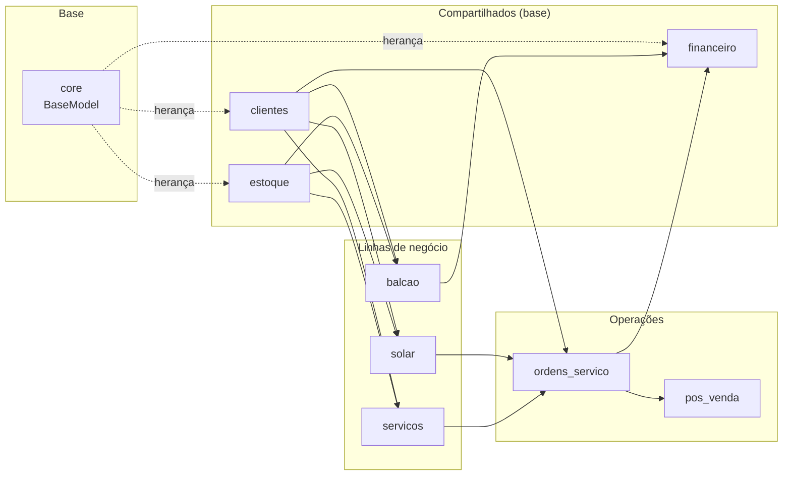

---

## 2. Ciclo de Vida Completo de uma Venda

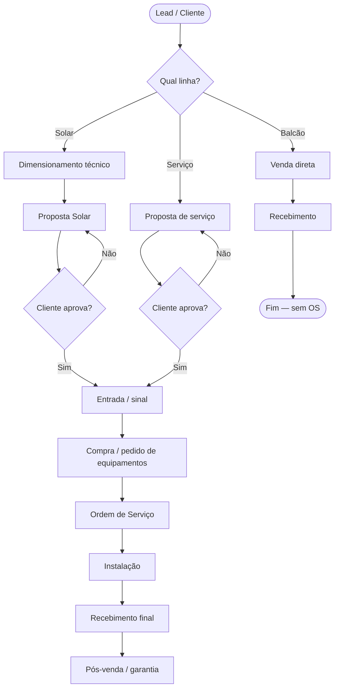

---

## 3. Fluxo Solar — Detalhado

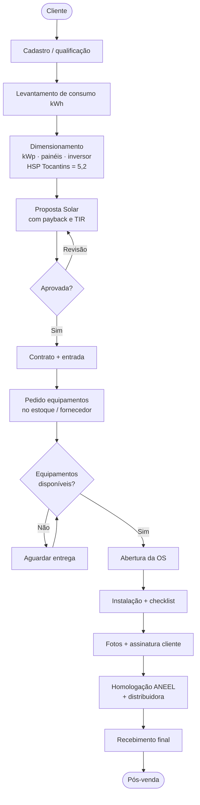

---

## 4. Fluxo Serviços — Segurança / Automação / Acesso

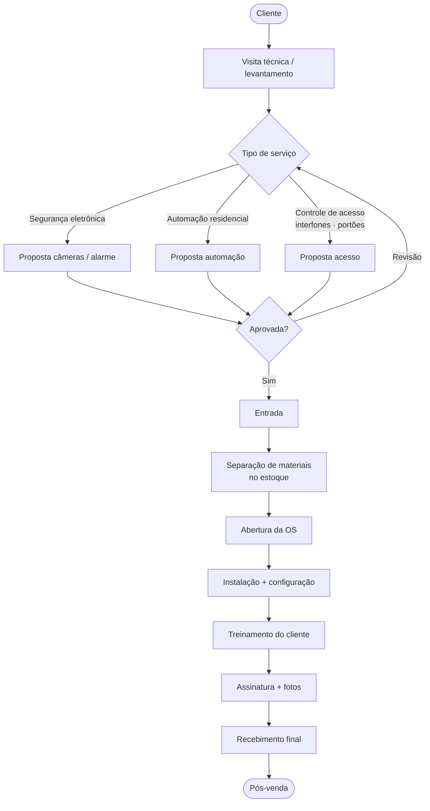

---

## 5. Fluxo Balcão — Venda Direta

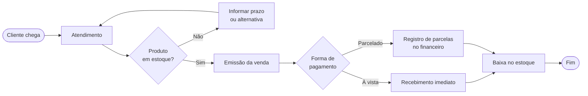

---

## 6. Entidades e Relacionamentos Principais

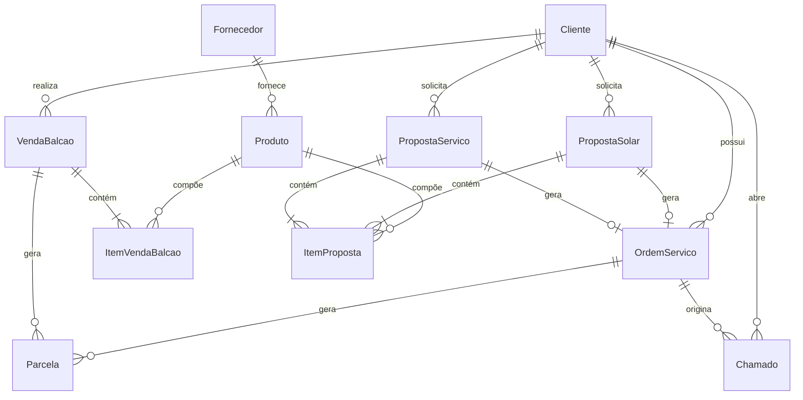

---

## 7. Estados de uma Ordem de Serviço

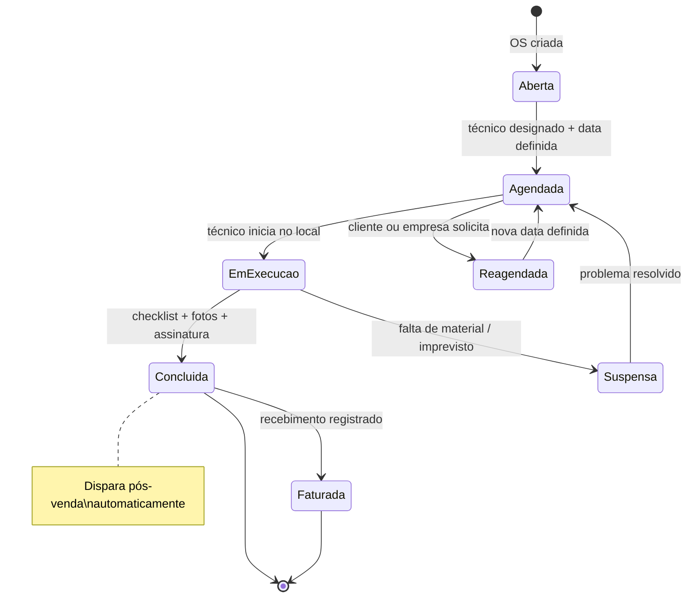

---

## 8. Fluxo de Pós-venda / Chamados

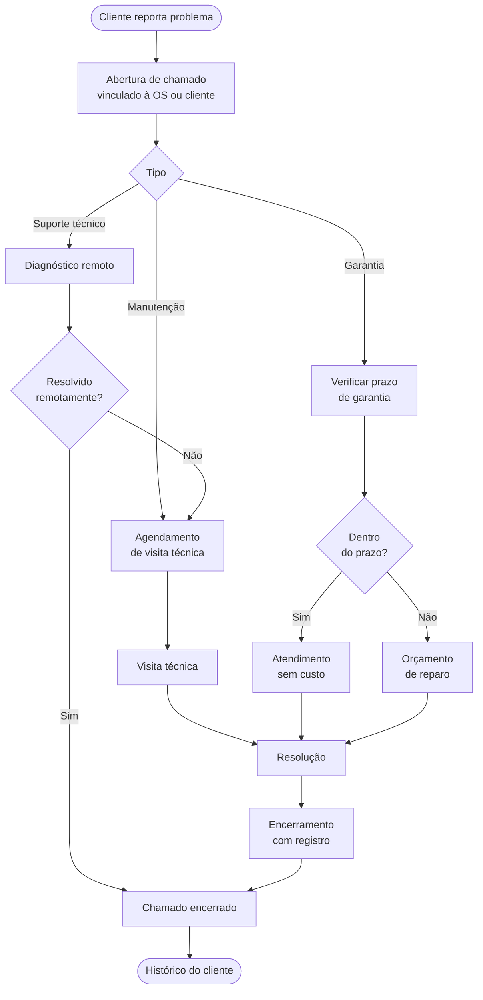

---

## 9. Estrutura de Pastas do Projeto

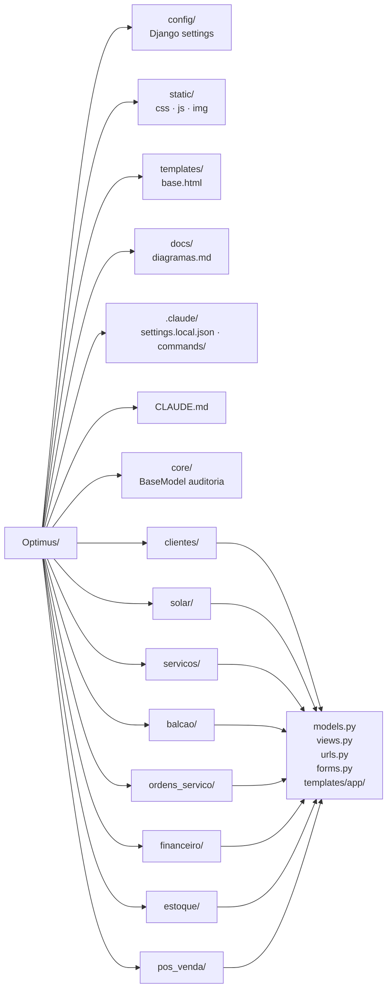

## 10. Fluxo de Dimensionamento Solar — Processo Completo

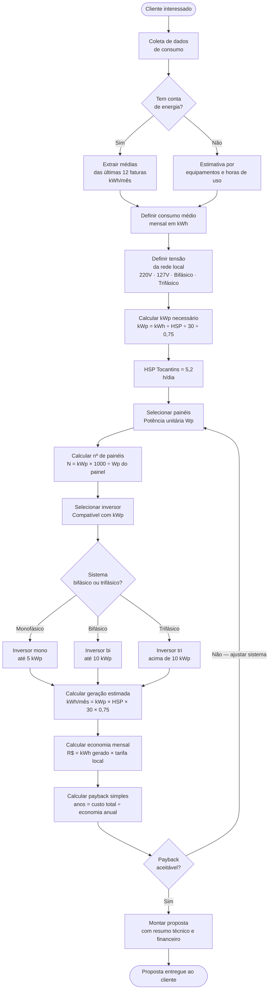

---

## 11. Cálculos do Dimensionamento Solar — Fórmulas

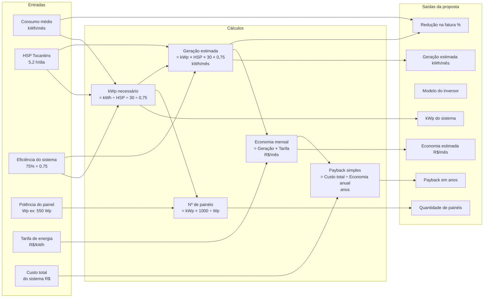

---

## 12. Estados de uma Proposta Solar

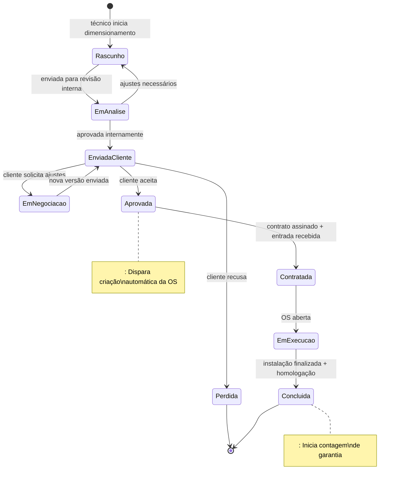

---

## 13. Homologação junto à Distribuidora

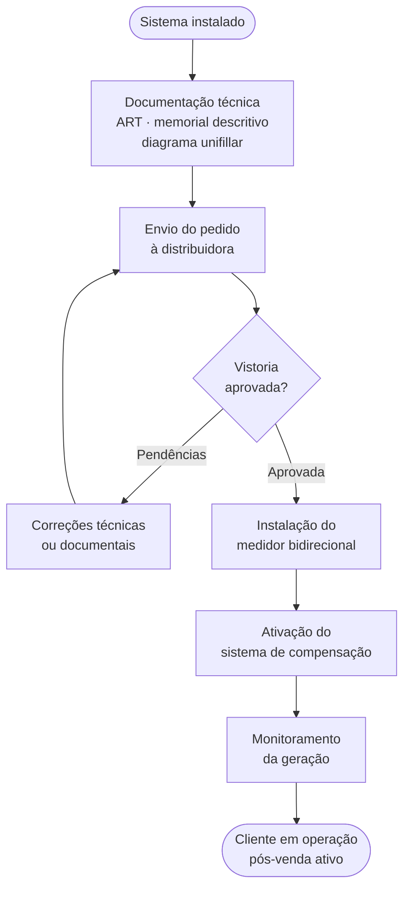
